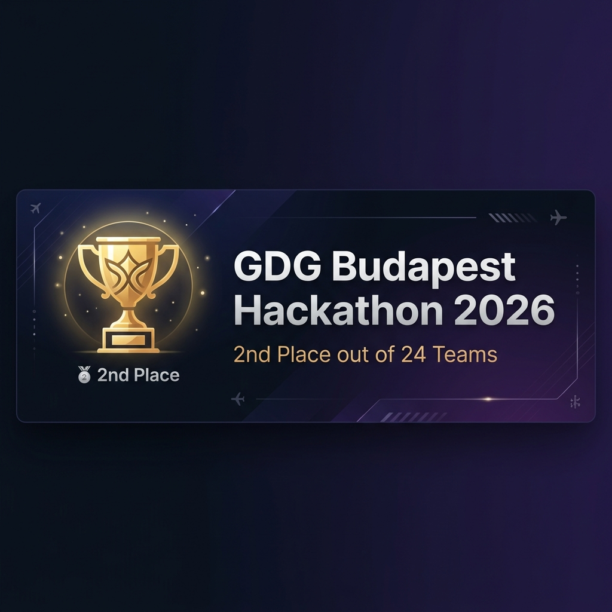
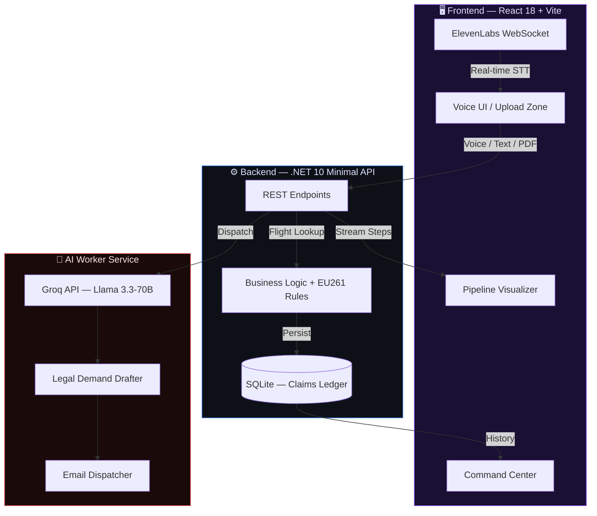

<div align="center">

<!-- 🏆 HACKATHON ACHIEVEMENT BANNER -->
<picture>
  <source media="(prefers-color-scheme: dark)" srcset="assets/hackathon-banner.png">
  <source media="(prefers-color-scheme: light)" srcset="assets/hackathon-banner.png">
  
</picture>

<br/>

<!-- ACHIEVEMENT CARD -->
<table>
<tr>
<td align="center">
<br/>

<br/><br/>
<sup>Selected as the <b>runner-up</b> out of <b>24 competing teams</b> at GDG Budapest FinTech Hackathon 2026</sup>
<br/><br/>
</td>
</tr>
</table>

<br/>

<!-- PROJECT TITLE -->


# AeroClaim Autopilot

### **Fully Autonomous, Voice-Native EU261 Aviation Compensation AI Agent**

<br/>

<!-- TECH BADGES -->
[](https://dotnet.microsoft.com/)
[](https://react.dev/)
[](https://vitejs.dev/)
[](https://tailwindcss.com/)
[](https://elevenlabs.io/)
[](https://groq.com/)
[](https://docker.com/)
[](LICENSE)

</div>

---

<br/>

## 🎯 The Problem

> Every year, **millions of EU passengers** are entitled to **€250 – €600** in compensation for flight delays and cancellations under **EU Regulation 261/2004**.
>
> Yet, the vast majority never claim it. Traditional claim agencies take **30%+ commission**, and airline bureaucracy is designed to exhaust claimants into giving up.

**AeroClaim Autopilot eliminates this entirely.** Passengers simply **speak into their microphone**, tell the AI their flight details, and the system autonomously verifies eligibility, drafts a bulletproof legal demand letter, and dispatches it directly to the airline — all in under 30 seconds.

<br/>

## ✨ Key Features

<table>
<tr>
<td width="50%">

### 🎙️ Voice-First Interface
Ultra-low latency push-to-talk powered by **ElevenLabs Scribe STT** over WebSockets. Handles background noise, normalizes phonetic flight dictations (e.g., *"Double You Six Two Two"* → `W622`), and provides real-time transcript feedback.

</td>
<td width="50%">

### ⚖️ Zero-Hallucination Legal Engine
AI-generated content is **strictly grounded** in deterministic flight data. The system queries a factual aviation database *before* the LLM (Llama 3.3-70B) ever generates text — ensuring every legal assertion is backed by verifiable data.

</td>
</tr>
<tr>
<td width="50%">

### 🤖 Transparent Agent Pipeline
A visual, step-by-step workflow the user watches in real-time:
**Input Parsing → Aviation DB Query → Worker Dispatch → LLM Analysis → EU261 Check → Legal Draft → Email Dispatch**

</td>
<td width="50%">

### 📊 Command Center Dashboard
Dark-mode, glassmorphic dashboard tracking total recovered compensation, success rates, and a persistent legal dispatch history with full audit trail.

</td>
</tr>
<tr>
<td width="50%">

### 🔊 AI Voice Briefing
After processing, **ElevenLabs TTS** (`eleven_turbo_v2_5`) synthesizes a personalized spoken briefing — the AI attorney *reads out* the claim verdict, compensation amount, and next steps to the user.

</td>
<td width="50%">

### 📄 Smart Document Intake
Beyond voice, users can drag-and-drop PDF boarding passes. The system extracts flight details automatically, feeding them into the same autonomous pipeline.

</td>
</tr>
</table>

<br/>

## 🏗️ System Architecture



<br/>

## 🛠️ Tech Stack

| Layer | Technology | Purpose |
|:------|:-----------|:--------|
| **Frontend** | React 18 + Vite | High-performance SPA with HMR |
| **Styling** | Tailwind CSS v4 + Framer Motion | Glassmorphic UI, micro-animations, adaptive dark mode |
| **Voice I/O** | ElevenLabs (Scribe STT + Turbo TTS) | Real-time speech recognition & synthesis over WebSocket |
| **Backend** | C# / .NET 10 Minimal APIs | Type-safe, high-throughput REST endpoints |
| **Architecture** | MediatR (CQRS) | Clean command/query separation |
| **Database** | Entity Framework Core + SQLite | Persistent claim ledger with full audit trail |
| **AI Model** | Groq API → Llama 3.3 70B | Legal demand drafting & EU261 analysis |
| **Infrastructure** | Docker + Docker Compose | One-command containerized deployment |

<br/>

## 📡 API Endpoints

| Method | Endpoint | Description |
|:-------|:---------|:------------|
| `POST` | `/api/claims/execute` | Core pipeline — accepts a flight number, runs full EU261 evaluation, returns eligibility + legal draft |
| `POST` | `/api/claims/send` | Dispatches the finalized legal demand email to the airline |
| `GET` | `/api/claims/history` | Retrieves the full claim ledger for the dashboard (top 50, ordered by date) |

> 📄 **See [`endpoints.md`](endpoints.md) for full request/response schemas and examples.**

<br/>

## 🚀 Getting Started

### Prerequisites

| Requirement | Version |
|:------------|:--------|
| .NET SDK | 10.0+ |
| Node.js | 20+ |
| Docker *(optional)* | Latest |
| ElevenLabs API Key | [Get one →](https://elevenlabs.io/) |
| Groq API Key | [Get one →](https://console.groq.com/) |

### Option 1: Docker (Recommended)

```bash
git clone https://github.com/yourusername/AeroClaimAutoPilot.git
cd AeroClaimAutoPilot
docker compose up --build
```

### Option 2: Manual Setup

**1. Backend**
```bash
cd AeroClaim.Api
dotnet restore
dotnet run
# ✅ API live at http://localhost:5000
```

**2. AI Worker**
```bash
cd AeroClaim.Worker
dotnet restore
dotnet run
# ✅ Worker live at http://localhost:5001
```

**3. Frontend**
```bash
cd AeroClaim.Web
npm install
npm run dev
# ✅ UI live at http://localhost:5173
```

**4. Environment Configuration**

Create `.env` in the `AeroClaim.Web` directory:
```env
VITE_API_BASE_URL="http://localhost:5000"
```

Ensure API keys are configured in the backend `appsettings.json` or via environment variables.

<br/>

## 🧪 How It Works — The Agentic Pipeline

```
┌─────────────────────────────────────────────────────────────────────┐
│                                                                     │
│  1. 🎤 USER SPEAKS         "My Wizz Air flight W622 was delayed     │
│                              four and a half hours..."              │
│                                                                     │
│  2. 🔤 STT + NORMALIZATION  ElevenLabs Scribe → Regex pipeline     │
│                              "Double You Six" → "W6"                │
│                                                                     │
│  3. ✈️  FLIGHT LOOKUP        Deterministic DB query for W62205      │
│                              → BUD→EIN, 270min delay, 1150km        │
│                                                                     │
│  4. ⚖️  EU261 EVALUATION     Article 7 threshold check:            │
│                              1150km + 270min → €250 eligible ✅      │
│                                                                     │
│  5. 📝 LEGAL DRAFTING        Llama 3.3-70B generates demand letter  │
│                              grounded in verified flight facts       │
│                                                                     │
│  6. 🔊 VOICE BRIEFING        ElevenLabs TTS reads the verdict:     │
│                              "Your claim is eligible for €250..."    │
│                                                                     │
│  7. 📧 EMAIL DISPATCH        One-click send to airline legal dept   │
│                                                                     │
└─────────────────────────────────────────────────────────────────────┘
```

<br/>

## 🛡️ Trust & Safety

| Principle | Implementation |
|:----------|:---------------|
| **No Hallucinated Facts** | Flight data comes from a deterministic source of truth, never generated by the LLM |
| **Human-in-the-Loop** | The pipeline pauses before email dispatch — users review the full legal draft first |
| **Graceful Fallback** | If the AI worker times out, a rule-based fallback engine completes EU261 math safely |
| **Transparent Processing** | Every pipeline step is visualized in real-time so users know exactly what the AI is doing |

<br/>

## 🏆 Hackathon Context

This project was built for the **GDG Budapest FinTech Hackathon 2026**, where it was awarded **🥈 2nd Place** out of 24 competing teams.

AeroClaim targets the intersection of **Finance & LegalTech** — recovering unrealized passenger compensation funds that airlines bank on consumers never claiming.

**What the judges valued:**
- ⚡ **Technical Depth** — Multi-service architecture with real-time voice streaming, not a wrapper over an API
- 🎨 **UX Innovation** — Replacing tedious legal forms with a single microphone interaction
- 🛡️ **AI Trustworthiness** — Deterministic fact grounding before any generative AI involvement
- 🔊 **ElevenLabs Integration** — Voice wasn't bolted on; it's the primary interface

> 📖 **See [`explanation.md`](explanation.md) for the full evaluation breakdown across all 6 judging criteria.**

<br/>

## 📁 Project Structure

```
AeroClaimAutoPilot/
├── AeroClaim.Api/            # .NET 10 Minimal API — REST endpoints, EF Core, business logic
├── AeroClaim.Worker/         # Background AI service — Groq/LLM integration, email dispatch
├── AeroClaim.Web/            # React 18 + Vite frontend — Voice UI, pipeline visualizer
├── docker-compose.yml        # One-command containerized deployment
├── endpoints.md              # Detailed API documentation
├── explanation.md            # Hackathon evaluation guide
└── AeroClaimAutoPilot.sln    # .NET solution file
```

<br/>

---

<div align="center">

**Built with ❤️ in Budapest**

<sub>AeroClaim Autopilot — Because your compensation shouldn't cost you 30%.</sub>

</div>
